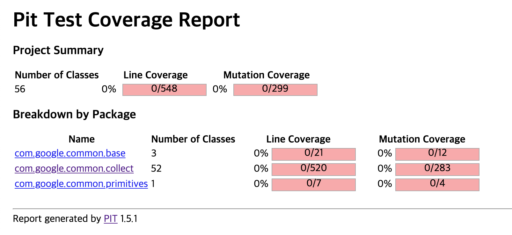

# Coursework 3

# Mutation Testing In Practice

## Open source project I selected

**Guava (Google Core Libraries for Java)**

[https://github.com/google/guava](https://github.com/google/guava)

Guava is a set of core Java libraries from Google that includes new collection types (such as multimap and multiset), immutable collections, a graph library, and utilities for concurrency, I/O, hashing, caching, primitives, strings, and more. It is widely used on most Java projects within Google, and widely used by many other companies as well.

### Apply PIT mutation tool

./guava

`mvn clean install`

./guava/guava-gwt

`mvn org.pitest:pitest-maven:mutationCoverage`

### Mutant that has not been killed

The Mutation Coverage of guava is 0%. Maybe I've got the wrong test and source code targeting.

I could not increase the Mutation Coverage because there was no time to do so due to numerous errors in the process of applying it to the project. :(
